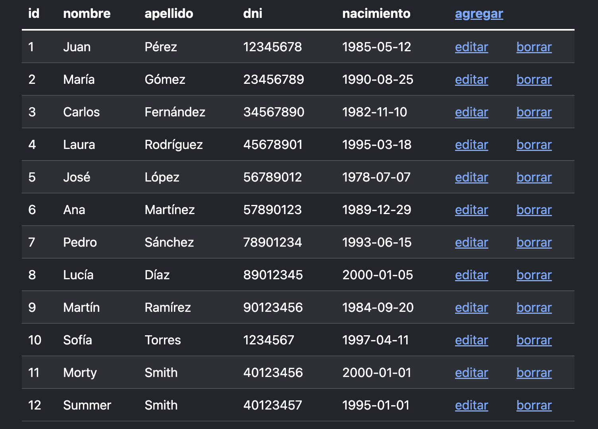
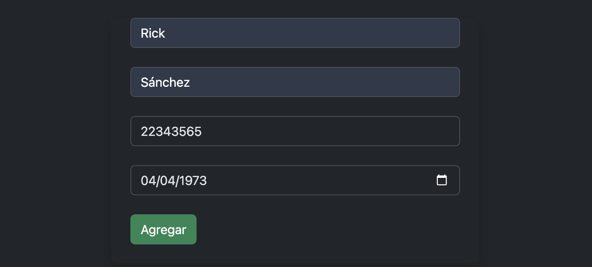
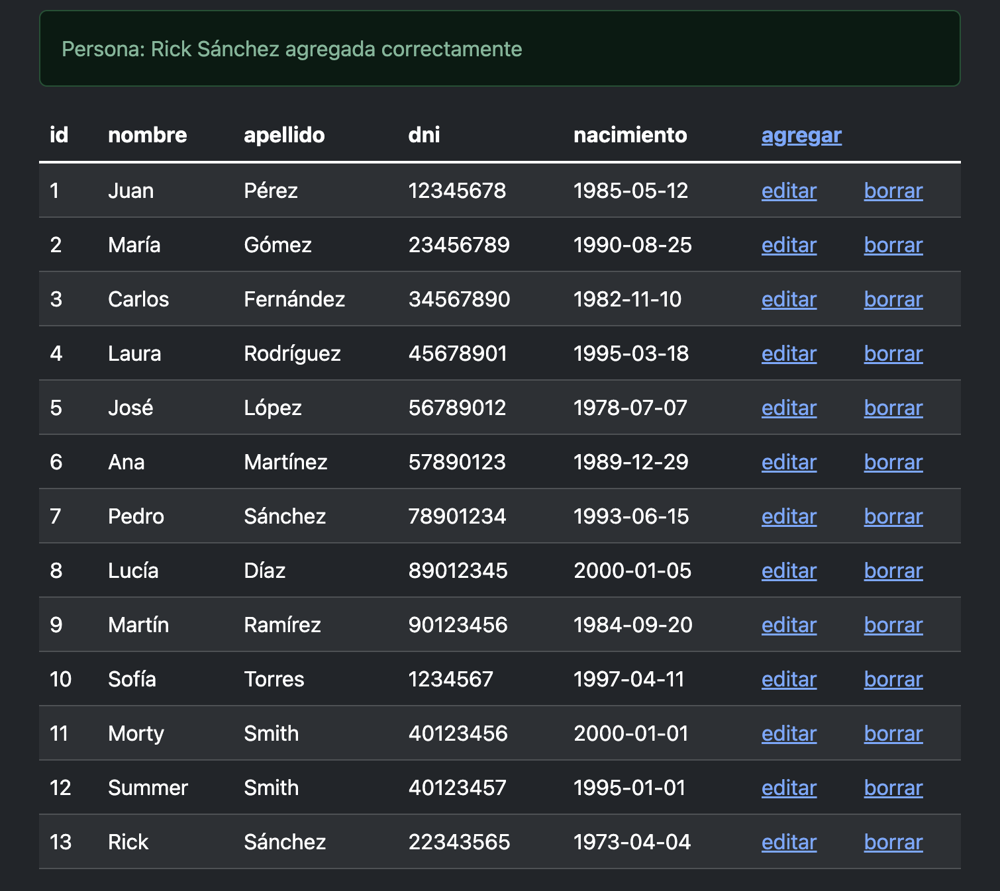

# concepto de flashing (mensajería en el CRUD)

1.- en el Dashboard o panel de control vamos a tener los botones de las acciones (agregar, modificar, eliminar)

2.- cuándo hacemos clic en el botón de la acción se presenta la vista (probablemente con un formulario) 

3.- al ejecutar la acción sucede el evento del CRUD (Create, read, Update, Delete) y en vez de generar una nueva vista con el mensaje de OK o en su caso el mensaje de error simplemente redirigimos al Dashboard y ahí es donde mostramos el mensaje

Para esto cuando nosotros hacemos una estructura 
    try{}  
    catch(){}

Vamos a generar una o varias variables de sesión que vamos a enviar con el método
 
    with()

Y finalmente en el Dashboard mostramos estas variables utilizando el helper  

    session()
